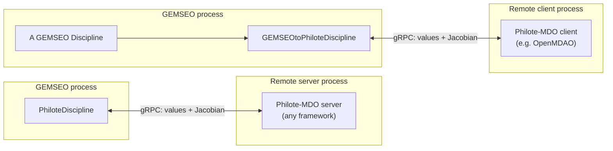

# Using GEMSEO with Philote-MDO

## What problem does this solve?

[Philote-MDO](https://github.com/MDO-Standards/Philote-Python) is a gRPC
protocol for exchanging MDO disciplines between tools. A discipline is
served by one process (possibly on another machine, in another language,
or built with another MDO framework) and called by a client process as if
it were local: the client sends input values, and the server streams back
the output values and, if available, the Jacobian.

`philote_mdo.gemseo` implements this protocol on the GEMSEO side, in
**both** directions:

- `PhiloteDiscipline` is a GEMSEO `Discipline` that connects to *any*
  (explicit) Philote-MDO server (be it a `philote-mdo` discipline, an
  OpenAeroStruct model, or an OpenMDAO group served through
  `philote_mdo.openmdao.OpenMdaoSubProblem`) and exposes it as a
  normal discipline, usable in an `MDOScenario` or an `MDA` like any
  other.
- `PhiloteImplicitDiscipline` does the same for an *implicit* Philote
  server, exposing its residuals to GEMSEO so that an MDA can solve its
  state equations -- see [Implicit disciplines](#implicit-disciplines)
  below.
- `GEMSEOtoPhiloteDiscipline` does the opposite: it wraps a GEMSEO
  `Discipline` so that it can be served over gRPC and called from any
  Philote-MDO client, in particular an OpenMDAO model.



Both directions carry the discipline's Jacobian, not just its output
values, so a remote discipline can be used in a gradient-based
optimization exactly like a local one. Both also carry the discipline's
discrete variables next to its continuous ones -- see
[Discrete variables](#discrete-variables) below.

This page walks through the first, and simplest, direction --
`PhiloteDiscipline` consuming a remote discipline -- using the complete
example [`examples/paraboloid_gemseo.py`](https://github.com/MDO-Standards/Philote-Python/blob/main/examples/paraboloid_gemseo.py).
The [next tutorial](./gemseo-openaerostruct.md) covers a realistic,
coupled OpenMDAO analysis and the opposite direction is demonstrated in
[`examples/sellar_gemseo_to_openmdao.py`](https://github.com/MDO-Standards/Philote-Python/blob/main/examples/sellar_gemseo_to_openmdao.py).

## Installation

```bash
pip install philote-mdo gemseo
```

`philote_mdo.gemseo` (which provides `PhiloteDiscipline` and
`GEMSEOtoPhiloteDiscipline`) is part of `philote-mdo` itself; GEMSEO is
not a hard dependency of the package, so it must be installed separately
(or via the `philote-mdo[gemseo]` extra).

## Walkthrough: optimizing a remote Paraboloid discipline

The example serves `philote_mdo.examples.Paraboloid`, a toy discipline
computing `f_xy(x, y)`, over gRPC, and uses it as the objective of a
GEMSEO optimization scenario that also has a constraint computed locally.
The full script is reproduced at the end of this page; the sections below
explain it piece by piece.

### Serving the discipline

Any Philote-MDO discipline (here, the built-in `Paraboloid` example) is
served by wrapping it in a `philote_mdo.general.ExplicitServer` and
attaching that server to a started gRPC server:

```python
def create_server() -> grpc.Server:
    server = grpc.server(futures.ThreadPoolExecutor(max_workers=10))
    server.add_insecure_port(f"[::]:{PORT}")
    server.start()
    return server
```

### Connecting a GEMSEO client to it

`PhiloteDiscipline` is the GEMSEO-side client. Connecting it to the
channel above is enough: at construction, it queries the server for the
discipline's inputs, outputs and available partial derivatives, and
builds its GEMSEO grammars from that metadata -- no manual declaration is
needed.

```python
def create_discipline(server: grpc.Server) -> PhiloteDiscipline:
    discipline = ExplicitServer(discipline=Paraboloid())
    discipline.attach_to_server(server)
    return PhiloteDiscipline(channel=grpc.insecure_channel(f"{HOST}:{PORT}"))
```

From this point on, `paraboloid_disc` behaves like any other GEMSEO
`Discipline`: `paraboloid_disc.execute(...)` calls the remote
`ComputeFunction` RPC, and `paraboloid_disc.linearize(...)` calls the
remote `ComputeGradient` RPC.

### Adding a local constraint

Not every discipline of a scenario has to be remote. Here, the
constraint `g = x + y` is computed locally through GEMSEO's
`AutoPyDiscipline`, which turns a plain Python function into a
discipline by inspecting its signature and its `return` statement:

```python
def compute_constraint(x: ndarray, y: ndarray) -> ndarray:
    # AutoPyDiscipline infers the output name from this assignment, so the
    # variable must be named "g" and returned as-is (not e.g. "return x + y").
    g = x + y
    return g
```

:::warning
`AutoPyDiscipline` infers the output name(s) by parsing the literal
`return` statement of the function, so it must be `return g` with `g`
assigned beforehand, not an inlined expression like `return x + y`.
:::

### Running the scenario

The remote discipline and the local constraint discipline are combined in
a standard `MDOScenario`, built with `create_scenario`:

```python
server = create_server()

try:
    paraboloid_disc = create_discipline(server)
    design_space = create_design_space()
    design_space.add_variable("x", lower_bound=-50, upper_bound=50, value=3.0)
    design_space.add_variable("y", lower_bound=-50, upper_bound=50, value=-4.0)

    scenario = create_scenario(
        [paraboloid_disc, AutoPyDiscipline(py_func=compute_constraint)],
        objective_name="f_xy",
        design_space=design_space,
        formulation_settings_model=DisciplinaryOpt_Settings(),
    )

    # 0 <= g <= 10
    scenario.add_constraint("g", constraint_type="ineq", positive=True)
    scenario.add_constraint("g", constraint_type="ineq", value=10.0)
    scenario.execute(algo_settings_model=COBYQA_Settings(max_iter=100))

    print("Optimal design found:", design_space.get_current_value(as_dict=True))
finally:
    # Stop the server explicitly:
    # its worker threads would otherwise keep the process alive.
    server.stop(0)
```

Running the script prints the optimal design found by COBYQA:

```text
Optimal design found: {'x': array([7.]), 'y': array([-7.])}
```

which matches `f_xy(7, -7) = -27`, the known minimum of the paraboloid
under `0 <= x + y <= 10` (here reached at the boundary `g = 0`).

## The full script

```python title="examples/paraboloid_gemseo.py"
from __future__ import annotations

from concurrent import futures

import grpc
from gemseo import create_design_space
from gemseo import create_scenario
from gemseo.disciplines.auto_py import AutoPyDiscipline
from gemseo.settings.formulations import DisciplinaryOpt_Settings
from gemseo.settings.opt import COBYQA_Settings
from numpy import ndarray

from philote_mdo.examples import Paraboloid
from philote_mdo.gemseo import PhiloteDiscipline
from philote_mdo.general import ExplicitServer

HOST = "localhost"
PORT = 50051


def create_discipline(server: grpc.Server) -> PhiloteDiscipline:
    discipline = ExplicitServer(discipline=Paraboloid())
    discipline.attach_to_server(server)
    return PhiloteDiscipline(channel=grpc.insecure_channel(f"{HOST}:{PORT}"))


def create_server() -> grpc.Server:
    server = grpc.server(futures.ThreadPoolExecutor(max_workers=10))
    server.add_insecure_port(f"[::]:{PORT}")
    server.start()
    return server


def compute_constraint(x: ndarray, y: ndarray) -> ndarray:
    # AutoPyDiscipline infers the output name from this assignment, so the
    # variable must be named "g" and returned as-is (not e.g. "return x + y").
    g = x + y
    return g


if __name__ == "__main__":
    server = create_server()

    try:
        paraboloid_disc = create_discipline(server)
        design_space = create_design_space()
        design_space.add_variable("x", lower_bound=-50, upper_bound=50, value=3.0)
        design_space.add_variable("y", lower_bound=-50, upper_bound=50, value=-4.0)

        scenario = create_scenario(
            [paraboloid_disc, AutoPyDiscipline(py_func=compute_constraint)],
            objective_name="f_xy",
            design_space=design_space,
            formulation_settings_model=DisciplinaryOpt_Settings(),
        )

        # 0 <= g <= 10
        scenario.add_constraint("g", constraint_type="ineq", positive=True)
        scenario.add_constraint("g", constraint_type="ineq", value=10.0)
        scenario.execute(algo_settings_model=COBYQA_Settings(max_iter=100))

        print("Optimal design found:", design_space.get_current_value(as_dict=True))
    finally:
        # Stop the server explicitly:
        # its worker threads would otherwise keep the process alive.
        server.stop(0)
```

See the actual, always up-to-date source at
[`examples/paraboloid_gemseo.py`](https://github.com/MDO-Standards/Philote-Python/blob/main/examples/paraboloid_gemseo.py)
in the repository.

## Discrete variables

Philote-MDO distinguishes **continuous** variables, which travel over the
wire as arrays of doubles, from **discrete** variables, which carry any
JSON-compatible value: a string, a boolean, an integer, a list, or a
nested structure. `philote_mdo.gemseo` supports them in both directions,
and nothing has to be configured to enable it.

### Serving a GEMSEO discipline that has discrete variables

`GEMSEOtoPhiloteDiscipline` classifies every name of the wrapped
discipline's grammars by asking the grammar's data converter whether that
name holds continuous data:

```python
discipline.input_grammar.data_converter.is_continuous(name)
```

A name reported as continuous is declared as a continuous Philote
variable; every other name is declared as a discrete one. A grammar
element typed `str`, `bool`, `int`, `dict` or `list` is therefore served
as a discrete variable automatically:

```python
class ScalingDiscipline(Discipline):
    default_grammar_type = GrammarType.SIMPLE

    def __init__(self):
        super().__init__()
        self.input_grammar.update_from_names(["x"])           # continuous
        self.input_grammar.update_from_types({"mode": str})   # discrete
        self.output_grammar.update_from_names(["y"])          # continuous
        self.output_grammar.update_from_types({"used_mode": str})  # discrete
```

:::note
`is_continuous` is the right question to ask, rather than `is_numeric`,
because an integer is numeric but a continuous Philote variable is an
array of doubles. An integer-valued variable therefore belongs to the
discrete side of the protocol, as it does in OpenMDAO.

A `SimpleGrammar` cannot see the dtype of an element it types as
`ndarray`, so an integer-valued *array* still travels as a continuous
variable. Use a `JSONGrammar` or a `PydanticGrammar` if that distinction
matters.
:::

### Consuming a remote discipline that has discrete variables

`PhiloteDiscipline` puts the server's discrete variables in its GEMSEO
grammars next to the continuous ones, bound to no type, since a discrete
variable may carry any value. They are then read and written like any
other variable:

```python
remote = PhiloteDiscipline(channel=grpc.insecure_channel("localhost:50051"))

out = remote.execute({"x": array([1.0, 2.0]), "mode": "triple"})

print(out["y"], out["used_mode"])
```

:::note
Discrete variables are never differentiated: no partial derivative is
declared for them, and they are excluded from the Jacobian, including
when it is requested in full with `compute_all_jacobians=True`.
:::

:::warning
Philote-MDO does not transfer default values, so a discrete input has no
default on the client side. It must be part of the input data passed to
`execute()`, just like a continuous one.
:::

## Implicit disciplines

A Philote *implicit* discipline does not compute its outputs directly:
it defines them through the residual equations $R(x, y) = 0$, where $x$
are the inputs and $y$ the outputs. GEMSEO calls $y$ the **state
variables**, and expects a discipline with residuals to take them as
inputs (the current guess), to return them as outputs next to the
residuals, and to declare the mapping between the two in
`io.residual_to_state_variable`.

`PhiloteImplicitDiscipline` does exactly that. Philote names a residual
after the output it belongs to, while GEMSEO needs the two names to
differ, so a residual is named after its state variable plus
`residual_name_suffix`, which defaults to `"_residual"`:

```python
from philote_mdo.gemseo import PhiloteImplicitDiscipline

quadratic = PhiloteImplicitDiscipline(
    channel=grpc.insecure_channel("localhost:50051")
)

print(set(quadratic.input_grammar))   # {"a", "b", "c", "x"}
print(set(quadratic.output_grammar))  # {"x", "x_residual"}
print(quadratic.io.residual_to_state_variable)  # {"x_residual": "x"}
```

Executing the discipline sends the inputs and the current state to the
`ComputeResiduals` RPC and returns the residuals; linearizing it sends
them to `ComputeResidualGradients` and returns $\partial R/\partial x$ and
$\partial R/\partial y$. That is all a GEMSEO MDA needs to solve the state
equations, for instance with a Newton solver, whose step is
$-\left[\partial R/\partial y\right]^{-1} R$:

```python
from gemseo.mda.newton_raphson import MDANewtonRaphson

mda = MDANewtonRaphson([quadratic, another_discipline])
out = mda.execute()

print(out["x"], out["x_residual"])
```

When the remote discipline is able to solve its own state equations, pass
`solve_state_equations=True`: executing the discipline then calls the
`SolveResiduals` RPC and returns the solved state variables, and
`io.state_equations_are_solved` tells the MDAs not to iterate on them.

```python
quadratic = PhiloteImplicitDiscipline(
    channel=grpc.insecure_channel("localhost:50051"),
    solve_state_equations=True,
)

out = quadratic.execute({"a": array([1.0]), "b": array([-5.0]),
                         "c": array([6.0]), "x": array([1.0])})

print(out["x"])  # 3.0, a root of x**2 - 5 * x + 6
```

:::note
The discrete inputs of an implicit discipline are part of the input
grammar and are sent with every residual, solve and gradient request. The
implicit Philote services never stream discrete outputs back, so the
discrete outputs of the remote discipline, if any, are left out of the
output grammar.
:::

:::warning
Two defects of GEMSEO 6.3.3 limit what an MDA can do with a discipline
that has residuals. Both are upstream, and neither affects the
discipline's own residuals or Jacobian, which are exact.

1. **A lone implicit discipline cannot be solved.** Its state variable
   makes it self-coupled, but `CouplingStructure.is_self_coupled`
   subtracts the state variables from the inputs that are also outputs,
   so the discipline is reported as weakly coupled and
   `MDANewtonRaphson` rejects it with *"has weakly coupled
   disciplines"*. Couple it with at least one other discipline, as in the
   example above, so that the group is a genuine cycle.
2. **Total derivatives across a state variable come out as zero.** In
   `JacobianAssembly.total_derivatives`, the columns of `dfun_dy` are
   assembled over `couplings_and_res` while the solution of the coupled
   linear system is ordered by `couplings_and_states`, so the state block
   of $\partial f/\partial y$ is looked up under the residual name and
   never found. Differentiate an MDA that contains an implicit discipline
   with care, and check the result against finite differences.
:::

## Where to go next

- [Coupling OpenAeroStruct and GEMSEO](./gemseo-openaerostruct.md) applies
  the same `PhiloteDiscipline` pattern to a realistic, internally-coupled
  OpenMDAO analysis, and shows how the discipline's non-design inputs
  must be set explicitly since Philote-MDO does not transfer GEMSEO's
  default values.
- [`examples/sellar_gemseo_to_openmdao.py`](https://github.com/MDO-Standards/Philote-Python/blob/main/examples/sellar_gemseo_to_openmdao.py)
  demonstrates the opposite direction with `GEMSEOtoPhiloteDiscipline`:
  GEMSEO's Sellar disciplines are served over gRPC and optimized from an
  OpenMDAO model.
